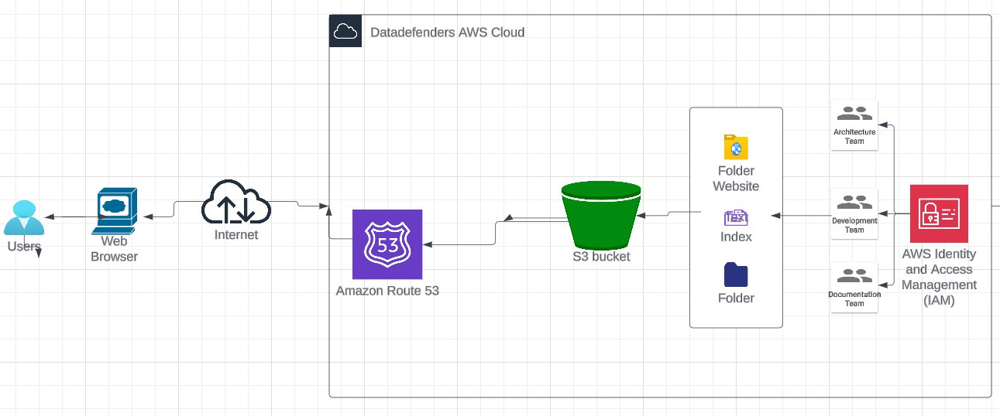

# Hosting a Secure E-Commerce Website on AWS

# Introduction

This project involves deploying a fully functional fashion e-commerce website using Amazon Web Services (AWS) to ensure high availability, security, and scalability.

The project made use of cloud technologies which involves AWS S3 bucket for storing the content of the website and hosting the website and Route 53 to configure a custom domain name for easy availability.

## Project overview

This project involved setting up a fully functional, static e-commerce website hosted on AWS infrastructure. Our primary objectives were:
- To host the website files on AWS S3, allowing for scalable and secure static content delivery.
- To manage and route our custom domain using AWS Route 53 for improved performance and reliability.

## Tech Stack

- **AWS S3**: Used to store and serve the website's static files (HTML, CSS, JavaScript, images).
- **AWS Route 53**: Configured for domain name management and DNS routing.
- 
## Project Workflow

The above picture illustrate the path taken to archive the aim of the project. This workfkow made use of the waterfall methodolgy of project planning. 

- The first layer involves preparing the site source code. 
- The Second layer is Uploading of the souce code to AWS S3    Bucket and setting permissions for website hosting.
- The third layer involves configuration of AWS Route 53 for domain name management and DNS routing 

## Archive

