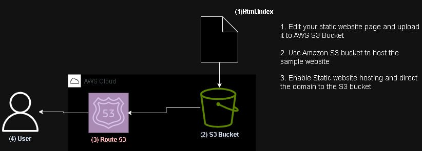

# Hosting a Secure E-Commerce Website on AWS

# Introduction

This project involves deploying a fully functional fashion e-commerce website using Amazon Web Services (AWS) to ensure high availability, security, and scalability.

The project made use of cloud technologies which involves AWS S3 bucket for storing the content of the website and hosting the website and Route 53 to configure a custom domain name for easy availability.

## Project overview

This project involved setting up a fully functional, static e-commerce website hosted on AWS infrastructure. Our primary objectives were:
- To host the website files on AWS S3, allowing for scalable and secure static content delivery.
- To manage and route our custom domain using AWS Route 53 for improved performance and reliability.

## Tech Stack

- **AWS S3**: Used to store and serve the website's static files (HTML, CSS, JavaScript, images).
- **AWS Route 53**: Configured for domain name management and DNS routing.
- 
## Project Workflow

The above picture illustrate the path taken to archive the aim of the project. This workfkow made use of the waterfall methodolgy of project planning. 

- The first layer involves preparing the site source code. 
- The Second layer is Uploading of the souce code to AWS S3    Bucket and setting permissions for website hosting.
- The third layer involves configuration of AWS Route 53 for domain name management and DNS routing 

## Getting Started

To view and interact with the project:

1. Download the source code uploaded in this repository
2. Upload Your Site Files to an S3 Bucket
   Follow the process listed below:
    1. Go to the S3 Console: AWS S3 Console.
    2. Click Create bucket.
    3. Enter a Bucket name that matches your domain name
       exactly (e.g., example.com).
    4. Choose the Region closest to your target audience.
    5. Under Bucket settings for Block Public Access,
      uncheck Block all public access and confirm.
    6. Click Create bucket.
    7. Upload the souce code downloaded into the bucket
       created 
3. Configure the Bucket for Static Website Hosting
    1. In your S3 bucket, go to the Properties tab.
    2. Scroll to Static website hosting and click Edit.
    3. Choose Host a static website.
    4. For Index document, enter index.html or your main
       page file.
   5. Optionally, add a custom error page under Error
      document (e.g., 404.html).
   6. Click Save changes.
4. Click on Bucket policy and then Edit.
   Paste the following policy, replacing your-bucket-name with your actual bucket name:

   

4. Click Save changes.
      
1. Clone the repository to your local environment:

Accessing the Hosted Website:

The website is hosted on an S3 bucket configured for static website hosting.
Use the custom domain set up through Route 53 to access the live website.
Domain Configuration:

We used Route 53 to purchase/manage the domain and set up DNS records.
The S3 bucket is linked to the domain, and HTTPS is enabled using AWS Certificate Manager (ACM) for secure access.
Deployment
Hosting on S3
Upload Files: Files are uploaded to an S3 bucket configured for static website hosting.
Permissions: S3 bucket permissions are set to allow public read access for all files.
Access Control: Policies are defined to ensure secure access to assets.
Domain Setup in Route 53
DNS Records: Route 53 is configured with an A record pointing to the S3 bucket’s website endpoint.
HTTPS Configuration: SSL/TLS certificates are issued through AWS Certificate Manager for secure, HTTPS access.
Contributors
Your Name
Other Team Member
Another Team Member
License
This project is licensed under the MIT License - see the LICENSE file for details.

### Explanation of Sections:

- **Project Overview**: Summarizes the project’s objectives and components.
- **Tech Stack**: Lists AWS services used.
- **Project Structure**: Shows a simple directory structure for clarity.
- **Getting Started**: Provides instructions on how others can access and work with the project.
- **Deployment**: Details specific steps for S3 hosting and Route 53 configuration.
- **Contributors**: Lists team members, linking to their GitHub profiles.
- **License**: Specifies project licensing.

Feel free to adjust based on any additional features or setup steps specific to your team’s projec
